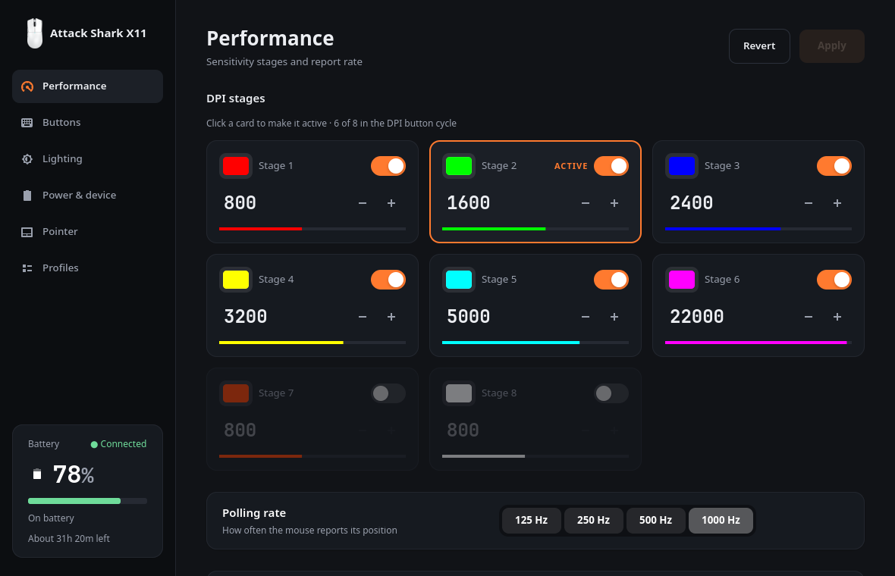
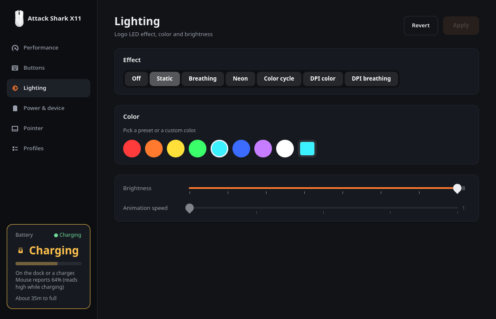
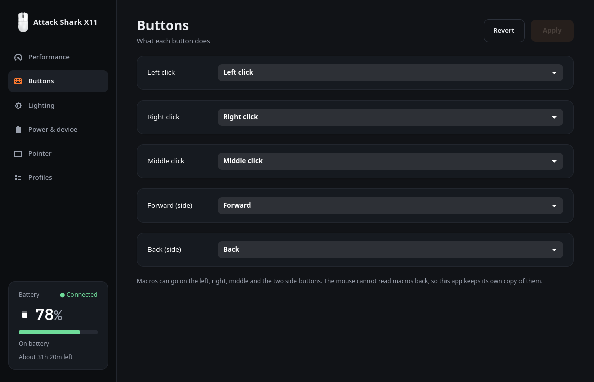
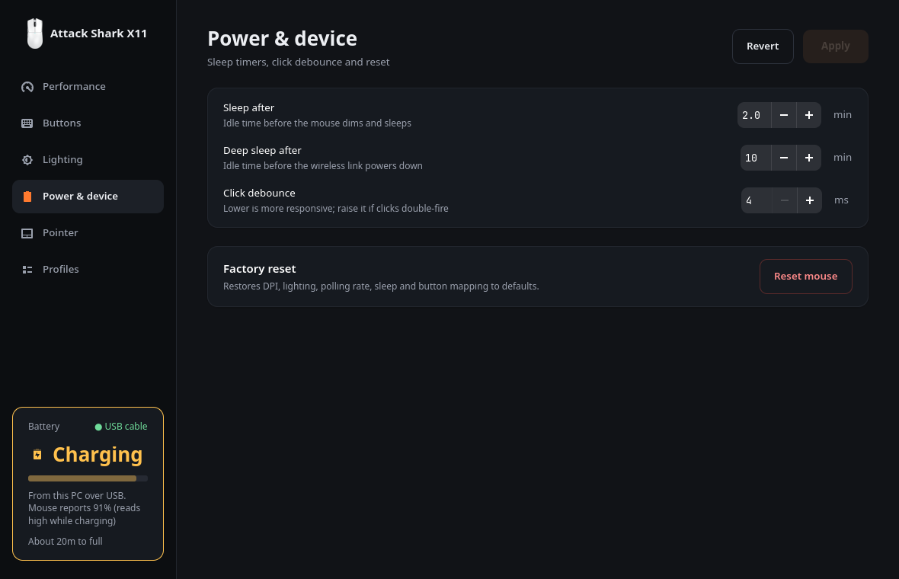

# Attack Shark X11 — Linux app

A desktop app for configuring the Attack Shark X11 gaming mouse on Linux. The
official software is Windows-only.

Python and GTK4/libadwaita, nothing else. No daemon, no browser, no Node.



## What it does

- **DPI** — eight stages, each with its own value and colour, choose which are in
  the button cycle, switch the active one
- **Buttons** — remap left, right, middle and both side buttons to clicks,
  keyboard keys or shortcuts, media keys, DPI cycling or Easy aim — the same
  actions the official software offers for the X11
- **Macros** — record key and click sequences with timing, on any of the five
  buttons, played a set number of times, until another mouse button is clicked,
  or while the button is held
- **Lighting** — effect, colour, brightness, animation speed
- **Power** — sleep and deep-sleep timers, click debounce
- **Battery** — percentage and charging state, updated within seconds of docking,
  shows when the mouse is asleep, and estimates time left from how fast your
  mouse charges and drains
- **Profiles** — save every setting as a preset, re-apply it, import and export
- **Pointer** — speed, acceleration and scrolling (Hyprland only; these belong to
  the compositor, not the mouse)

## Screenshots

| Performance | Lighting |
| --- | --- |
|  |  |
| **Buttons** | **Power & device** |
|  |  |

The battery card shows whether the mouse is on battery, on its dock or charger,
or plugged into the PC by cable. Battery values in these screenshots are examples.

## Install

```bash
git clone https://github.com/HolyJoey/attack-shark-x11.git
cd attack-shark-x11
./install.sh
```

The installer copies the app into `~/.local/share`, adds a menu entry, and asks
before installing one udev rule with `sudo`. The rule is needed because raw HID
access is root-only by default. `./uninstall.sh` reverses all of it.

**Upgrading?** Run `./install.sh` again. Earlier versions installed the rule as
`99-attack-shark-x11.rules`, which runs too late to grant access to a newly
plugged-in mouse; the installer swaps it for `70-attack-shark-x11.rules`.

**Requirements:** Python 3, PyGObject, GTK 4, libadwaita.

| Distro | Packages |
| --- | --- |
| Debian / Ubuntu | `python3-gi gir1.2-gtk-4.0 gir1.2-adw-1` |
| Fedora | `python3-gobject gtk4 libadwaita` |
| Arch | `python-gobject gtk4 libadwaita` |

## Hardware

Works over the 2.4 GHz receiver (`1d57:fa60`) and the USB cable (`1d57:fa55`).
Over the cable the battery card says so, instead of showing it as on a dock or
charger. Macros can only be recorded over the receiver: the vendor software
uses a different macro layout on the cable, and that isn't implemented.

The vendor's software covers around 18 mice, so other models may speak the same
protocol — reports and packet captures are welcome.

## Known limits

- **Macros can't be read back.** The mouse has no read path for them, so the app
  keeps its own copy of what it wrote.
- **DPI above 10,000 lands on 200-point steps.** The sensor stores half the value
  above 10,000, so only even hundreds are representable. Below that it is exact
  in 50-point steps.
- **The battery percentage is a voltage reading.** The mouse doesn't count charge;
  it reads the battery's voltage, which sits high while charging and for several
  minutes after undocking. Expect it to jump up on the dock and drift back down
  afterwards. The app leaves that settling period out of its estimates.
- **Time left needs some history first.** The app has to watch about 20 minutes
  of charging, and of normal use, before it knows your mouse's rates; after that
  the estimate shows straight away. Freshly charged, the reading sits at 100% for
  a while, and there's no estimate until it starts to drop.
- **Pointer settings need Hyprland.** The page hides itself otherwise, and applying
  lasts until Hyprland restarts unless you also write the config file.

## Credit

Built on the protocol research and TypeScript driver by
[HarukaYamamoto0](https://github.com/HarukaYamamoto0/attack-shark-x11-driver)
(MIT). The device layer here is a Python port of that work, with five fixes found
by testing against real hardware:

- the lighting packet's checksum was never recalculated, so lighting changes were
  rejected by the mouse
- the light mode byte wasn't shifted back when read, so reading then writing
  scrambled the mode
- button slots come back at the offsets they're written to, not the shuffled order
  the protocol notes describe
- the macro repeat count sits at offset 8, and the side buttons are ids 7 and 8
- the macro checksum starts at byte 8 and leaves out the play mode, so the mouse
  silently drops any macro that isn't "repeat N times"; it starts at byte 4, as
  in the official software

Over the USB cable, the upstream driver cuts the DPI packet one byte short,
dropping half its checksum; the mouse declares 52 bytes, and this app sends 52.

`protocol-reference/` holds the upstream protocol notes and packet captures, and
`protocol-reference/docs/vendor-software-findings.md` records what disassembling
the official software showed: its full button-action table, how it handles the
battery, and how it talks to the mouse over the cable.

## License

MIT, also in [`LICENSE`](LICENSE):

```text
MIT License

Copyright (c) 2026 HarukaYamamoto0 (original TypeScript driver)
Copyright (c) 2026 HolyJoey (Python port and GTK app)

Permission is hereby granted, free of charge, to any person obtaining a copy
of this software and associated documentation files (the "Software"), to deal
in the Software without restriction, including without limitation the rights
to use, copy, modify, merge, publish, distribute, sublicense, and/or sell
copies of the Software, and to permit persons to whom the Software is
furnished to do so, subject to the following conditions:

The above copyright notice and this permission notice shall be included in all
copies or substantial portions of the Software.

THE SOFTWARE IS PROVIDED "AS IS", WITHOUT WARRANTY OF ANY KIND, EXPRESS OR
IMPLIED, INCLUDING BUT NOT LIMITED TO THE WARRANTIES OF MERCHANTABILITY,
FITNESS FOR A PARTICULAR PURPOSE AND NONINFRINGEMENT. IN NO EVENT SHALL THE
AUTHORS OR COPYRIGHT HOLDERS BE LIABLE FOR ANY CLAIM, DAMAGES OR OTHER
LIABILITY, WHETHER IN AN ACTION OF CONTRACT, TORT OR OTHERWISE, ARISING FROM,
OUT OF OR IN CONNECTION WITH THE SOFTWARE OR THE USE OR OTHER DEALINGS IN THE
SOFTWARE.
```
